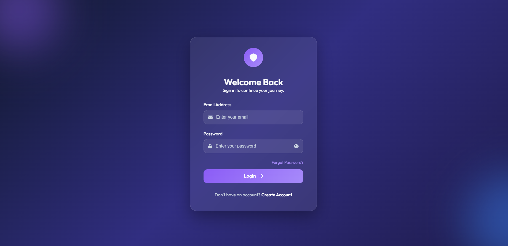
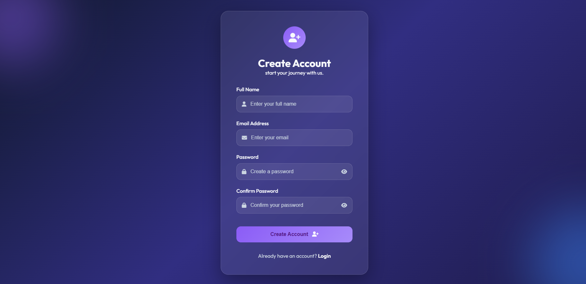
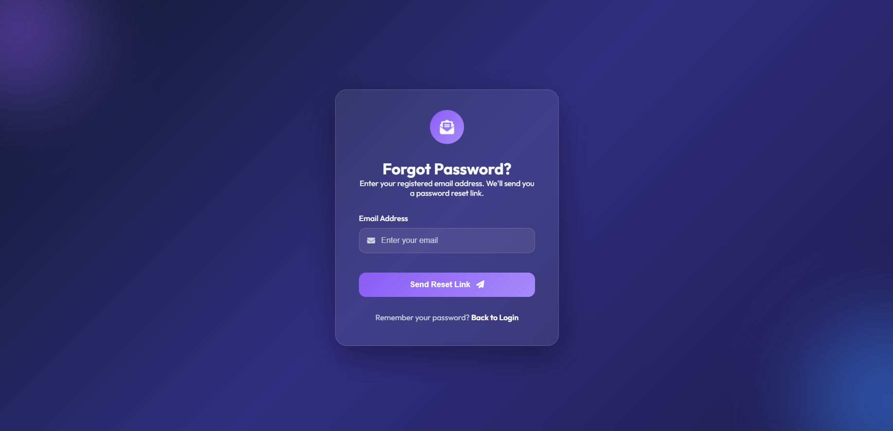

# Login-Page-UI

## 📸 Project Preview







---

## 📌 Overview

This is a modern authentication interface built using HTML, CSS, and JavaScript. The project features a premium glassmorphism design, smooth animations, responsive layouts.

---

## ✨ Features

- Modern Glassmorphism UI
- Responsive Design
- Login Page
- Register Page
- Forgot Password Page
- Password Show/Hide Toggle
- Smooth Hover & Focus Effects

---

## 🛠 Technologies Used

- HTML5
- CSS3
- JavaScript
- Font Awesome
- Google Fonts (Outfit)

---

## 📱 Responsive Design

- Desktop
- Tablet
- Mobile

---

## 📂 Folder Structure

```text
auth-ui/

│── login.html
│── register.html
│── forgot-password.html
│── README.md
│── .gitignore
│
└── assets/
    │
    ├── css/
    │     └── style.css
    │
    ├── js/
    │     └── script.js
    │
    └── screenshots/
          ├── login.png
          ├── register.png
          └── forgot-password.png
```

## 🚀 How to Run

1. Clone the repository
2. Open the project folder
3. Open `login.html` in your browser

---

## 👨‍💻 Author

**Ridham Shah**

---
